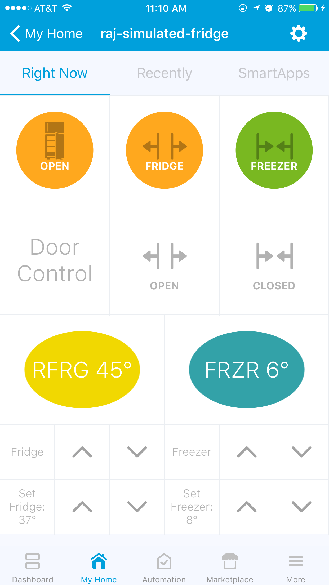

.. _composite-devices:

Composite Devices
=================

Devices such as Hue LAN bridge, AEON Z-Wave SmartStrip, or a Zooz ZEN20 Z-Wave Power Strip have multiple components, and each component can be controlled independently.
For example, a Zooz ZEN20 Z-Wave Power Strip can be used with a separate Thing connected to each of its five outlets and each Thing can have its own SmartApp.

SmartThings categorizes such a multiple-component device as a *composite device.*
A device is said to be a composite device when it treats each of its component as its child device.
Integrating a composite device into SmartThings platform involves incorporating the composite device functionality into its Device Handler.
Additionally, you may need to modify the Service Manager SmartApp and the SmartApp.

----

.. _device_handler_for_composite_device:

Device Handler for a Composite Device
-------------------------------------

When you integrate a composite device into SmartThings, the composite device maintains a parent-child relationship between itself and its child devices.
For example, the Device Handler of Zooz ZEN20 Z-Wave Power Strip composite device implements the Power Strip as a parent device and each outlet as a separate child device.
More specifically, each individual outlet of the Power Strip is implemented as a *child device instance* of Zooz Power Strip Outlet, whereas the Power Strip itself is an instance of Zooz Power Strip as a *parent device*.

Similarly, the Hue bridge Device Handler implements the Hue bridge as a parent device and Hue bulbs as child devices of the Hue bridge parent device.

.. _composite_device_parent_device_handler:

Parent Device Handler
^^^^^^^^^^^^^^^^^^^^^

Let's look at how to set up a parent Device Handler.
For example, in the Device Handler of the Zooz ZEN20 Z-Wave Power Strip composite device, the parent device functionality shown below:

- Creates a *child device instance* of ``Zooz Power Strip Outlet`` device for each outlet of the Power Strip, by using the :ref:`addChildDevice_DH_ref` method, as below:

.. code-block:: groovy

	metadata {
		definition (name: "ZooZ Power Strip", namespace: "smartthings", author: "SmartThings") {
		capability "Switch"
		capability "Refresh"
		capability "Configuration"
		capability "Actuator"
		capability "Sensor"
		fingerprint deviceId: "0x1004", inClusters: "0x5E,0x85,0x59,0x5A,0x72,0x60,0x8E,0x73,0x27,0x25,0x86", manufacturer: "015D", model: "F51C", prod: "0651", deviceJoinName: "ZooZ ZEN 20 Power Strip"
	}

	...

	def installed() {
		createChildDevices()
		response(refresh() + configure())
	}

	...

	private void createChildDevices() {
		// Save the device label for updates by updated()
		state.oldLabel = device.label
		// Add child devices for all five outlets of Zooz Power Strip
		for (i in 1..5) {
    		addChildDevice("ZooZ Power Strip Outlet", "${device.deviceNetworkId}-${i}", null,[completedSetup: true, label: "${device.displayName} (CH${i})", isComponent: true, componentName: "ch$i", componentLabel: "Channel $i"])
		}
	}

and,

- Creates child device APIs such as:

.. code-block:: groovy

	void childOn(String dni) {
 		onOffCmd(0xFF, channelNumber(dni))
 	}
 	void childOff(String dni) {
 		onOffCmd(0, channelNumber(dni))
 	}

----

.. _composite_device_child_device_handler:

Child Device Handler
^^^^^^^^^^^^^^^^^^^^

Next, the below Device Handler code sets up the *outlet* of the Zooz ZEN20 Z-Wave Power Strip device as the *child device instance*.

.. code-block:: groovy

	metadata {
	definition (name: "ZooZ Power Strip Outlet", namespace: "smartthings", author: "SmartThings") {
		capability "Switch"
		capability "Actuator"
		capability "Sensor"
	}

	...

	void on() {
		parent.childOn(device.deviceNetworkId)
	}

	void off() {
		parent.childOff(device.deviceNetworkId)
	}

In the above example, the method calls, ``parent.childOn(device.deviceNetworkId)`` and ``parent.childOff(device.deviceNetworkId)``, are the means of communication between the parent and the child instances of this composite device.

----

.. _composite_device_deleting:

Deleting a Composite Device
---------------------------

Deleting a composite parent device will delete all children devices.
For example, deleting the Power Strip itself will delete its outlets as devices from the SmartThings platform.

SmartApps can be configured to control individual outlets as well as the entire power strip.
In such a case, if you try to delete the Power Strip parent device itself, then you are given an option to force-delete the outlet device.

If you try to delete a composite device from your SmartThings mobile app, then the following applies:

- If the parameter ``isComponent`` is set to ``true``, as shown in the :ref:`composite_device_parent_device_handler` example above, then the device is hidden from the Things view and you will not be presented with the option of deleting child devices individually.

- If the parameter ``isComponent`` is set to ``false``, then you can delete individual child devices.

.. note::

	Note that the following applies for a composite device:

	- A single SmartApp can control all the components, each independently, sending and receive messages from each component device.

	- A single SmartApp can control all components together in an all-or-nothing fashion.

----

.. _composite_device_tiles:

Composite Device Tiles
----------------------

Child device tiles can be visually pulled together into a composite tile.
On SmartThings mobile app, such a composite tile represents a rich interface for the display and control of a composite device.

For example, consider a refrigerator composite device that is built with two child components, i.e., the fridge door and the temperature control. 

In the fridge door child Device Handler, the tile for the fridge door ``mainDoor`` is defined normally with the ``standardTile`` method, as below:

.. code-block:: groovy

    // Fridge door child component Device Handler
    metadata {
        definition (name: "Simulated Refrigerator Door", namespace: "smartthings/testing", author: "SmartThings") {
            capability "Contact Sensor"
            capability "Sensor"
            capability "open"
            capability "close"
        }
    	tiles {
         standardTile("mainDoor", "device.contact", width: 2, height: 2, decoration: "flat") {
         state("closed", label:'Fridge', icon:"st.contact.contact.closed", backgroundColor:"#79b821")
         state("open", label:'Fridge', icon:"st.contact.contact.open", backgroundColor:"#ffa81e")
         }
        }
    ...

    }

Then, by using the method :ref:`childDeviceTile_DH_ref` within the refrigerator parent Device Handler, we can customize how the above fridge door tile ``mainDoor`` is pulled visually into the refrigerator composite tile. 
See below:

.. code-block:: groovy

    // Refrigerator parent Device Handler
    metadata {
        definition (name: "Simulated Refrigerator", namespace: "smartthings/testing", author: "SmartThings") {
            capability "Contact Sensor"
        }
    	tiles {
         childDeviceTile("mainDoor", "mainDoor", height: 2, width: 2, childTileName: "mainDoor")
        }
    ...

    }

The example below illustrates how to put together a mobile visual interface on SmartThings mobile app for a simulated refrigerator composite device.

----

Example: Simulated refrigerator
^^^^^^^^^^^^^^^^^^^^^^^^^^^^^^^

The simulated refrigerator in this example is a composite device with two components (child devices):

- The simulated main refrigerator (fridge) compartment, and 
- A simulated freezer compartment.

Each compartment has its own door, its own temperature, and its own temperature setpoint. 
Each compartment is modeled as a child device of the main refrigerator device.

From IDE, create a *New Device* (see :ref:`create-virtual-device`) and set it to *Type* "Simulated Refrigerator". 
This will create the composite parent device *Simulated Refrigerator.*
You will see it appear in the *Things* view of your SmartThings mobile app.
Tap on it to see the *Detail* view of it. 

The mobile app view of the Simulated Refrigerator composite device, with the detail view on the right, looks as below:

.. image:: ../img/composite-devices/sim_fridge_thing.png
   :width: 350 px

.. note::
	
	If you are new to SmartThings tiles, see :ref:`device_handler_tiles` before you proceed further.

The composite device tile for the refrigerator door, shown in the top row of the detail view above, is put together as below:

- In the child Device Handler for the Simulated Refrigerator Door, the tile ``mainDoor`` is defined in the ``tiles()`` section. The ``width`` and ``height`` parameters defined here will be overridden by the parent Device Handler setting.

.. code-block:: groovy
	
	metadata {
	    definition (name: "Simulated Refrigerator Door", namespace: "smartthings/testing", author: "SmartThings") {
	    	capability "Contact Sensor"
	    	capability "Sensor"
	    	command "open"
	    	command "close"
	    }
	    tiles {
	        standardTile("mainDoor", "device.contact", width: 2, height: 2, decoration: "flat") {
	            state("closed", label:'Fridge', icon:"st.contact.contact.closed", backgroundColor:"#79b821")
	            state("open", label:'Fridge', icon:"st.contact.contact.open", backgroundColor:"#ffa81e")
	        }
	    }
	}

- In the Simulated Refrigerator parent Device Handler, the method :ref:`childDeviceTile_DH_ref` is used in the ``tiles()`` section to visually configure this child device ``mainDoor`` tile. The ``width`` and ``height`` settings here will override the settings for this tile in the child Device Handler. 

.. code-block:: groovy
    
    metadata {
        definition (name: "Simulated Refrigerator", namespace: "smartthings/testing", author: "SmartThings") {
            capability "Contact Sensor"
        }
    	tiles {
         childDeviceTile("mainDoor", "mainDoor", height: 2, width: 2, childTileName: "mainDoor")
        }
    ...

    }
    def installed() {
        state.counter = state.counter ? state.counter + 1 : 1
        if (state.counter == 1) {
            // A tile with the name "mainDoor" exists in the tiles() method of the child Device Handler "Simulated Refrigerator Door" above.
            addChildDevice(
                "Simulated Refrigerator Door",
                "${device.deviceNetworkId}.2",
                null,
                [completedSetup: true, label: "${device.label} (Main Door)", componentName: "mainDoor", componentLabel: "Main Door"])
        }
    }

----

.. note::
	
	While the ``width`` and ``height`` parameters in the ``childDeviceTile()`` in the parent Device Handler will override the settings of these parameters in the child Device Handler, any ``icon`` setting specified in the child Device Handler will *not* be overriden by the ``childDeviceTile()``.

----

Example composite tile code
^^^^^^^^^^^^^^^^^^^^^^^^^^^

Copy the following three composite device Device Handler files and create your own three Device Handlers with *From Code* option (see :ref:`create-device-handler`): 

- Parent Device Handler file for the `Simulated Refrigerator <https://github.com/SmartThingsCommunity/SmartThingsPublic/blob/master/devicetypes/smartthings/testing/simulated-refrigerator.src/simulated-refrigerator.groovy>`_ composite parent device.
- Child Device Handler file for the `Simulated Refrigerator Door <https://github.com/SmartThingsCommunity/SmartThingsPublic/blob/master/devicetypes/smartthings/testing/simulated-refrigerator-door.src/simulated-refrigerator-door.groovy>`_ component device, and 
- Child Device Handler for the `Simulated Refrigerator Temperature Control <https://github.com/SmartThingsCommunity/SmartThingsPublic/blob/master/devicetypes/smartthings/testing/simulated-refrigerator-temperature-control.src/simulated-refrigerator-temperature-control.groovy>`_ component device.

.. note::
	
	Make sure to publish *For Me* the above three Device Handlers before you proceed further.

Follow the code in the Device Handlers you copied over to see how the rest of the visual layout is configured for the entire Simulated Refrigerator composite device.
