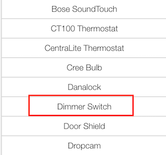
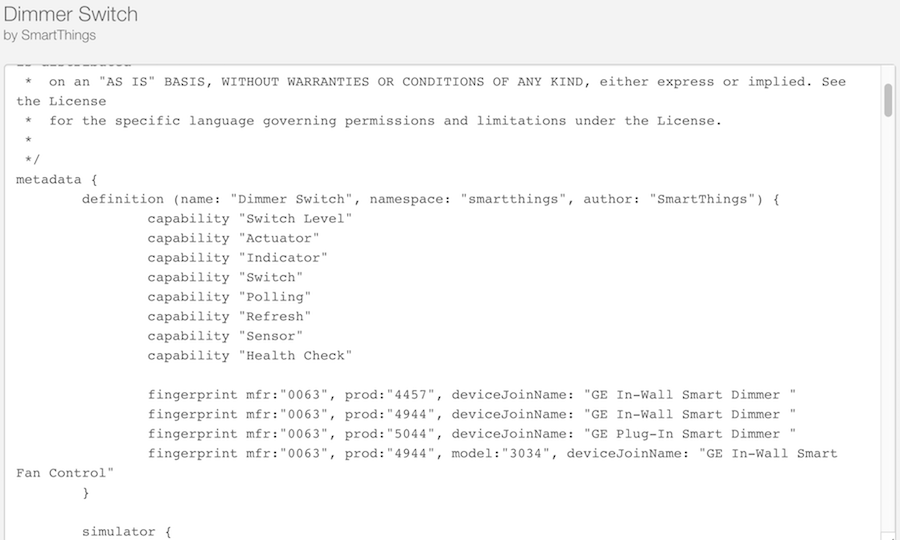
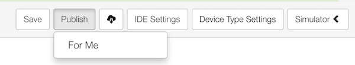
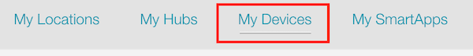
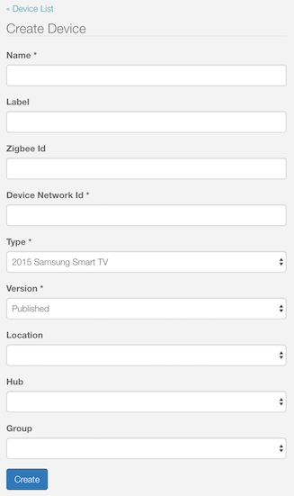
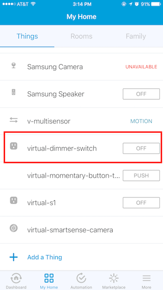
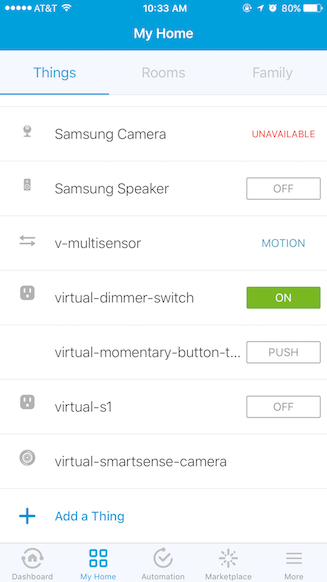
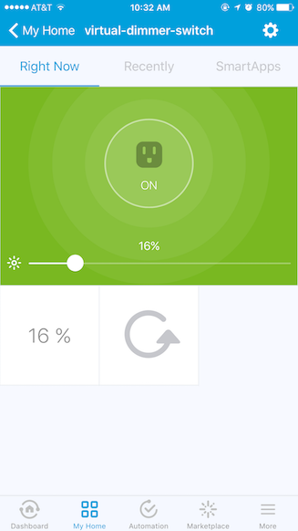

.. _device-handler-quickstart:

Quick Start
===========

A Device Handler is a representation of a physical device in the SmartThings platform.
It is responsible for communicating between the actual device and the SmartThings platform.

Alternately, a Device Handler can also be associated with a Virtual Device when a physical device is not yet available.
This section will walk you through creating your first custom Device Handler and testing it with a Virtual Device.

.. warning::

    Before you proceed, ensure that you are on the correct Location on IDE.
    Follow the prerequisites described in :ref:`ide_requirements`.

    If you are new to SmartThings development, consider starting with the :ref:`Getting Started <get-started-overview>` material.

----

.. _create-device-handler:

Create a new Device Handler
---------------------------

From IDE click on the *My Device Handlers* link on the top menu.
Here you will see all your Device Handlers, if you have any.

.. figure:: ../img/device-types/ide-device-types.png

Create a new Device Handler by clicking on the *+Create New Device Handler* button in the upper-right of the page.

You will see a form for creating a new Device Handler.
Note the tabs at the top of the form, showing different options for creating a new Device Handler:

.. figure:: ../img/device-types/new-device-type-form.png

Select the *From Template* tab.

We are going to create a new Device Handler from the Dimmer Switch template.
Click on the *Dimmer Switch* in the menu on the left.

You will now see the Dimmer Switch Device Handler code on the right.

Take a minute to look at the code and its structure.
Don't worry about the details yet - for now, just take note of the anatomy of the Device Handler:

----

Next, make a few changes to this code to make it yours.
In the definition method, change the ``name`` from "Dimmer Switch" to something like "My Dimmer Switch", the ``namespace`` to your github user account (or you can leave it blank), and the ``author`` to your name.

Click the *Create* button below the editor, and then click *Publish* and *For Me* on the next screen.

----

.. _create-virtual-device:

Create a Virtual Device
-----------------------

Next, we will create a Virtual Device and associate it with the Device Handler we just created above.

From the top menu of the IDE, click on the *My Devices*.

Click on *+New Device* on the top-right.
This will take you to *Create Device* page.

Follow below steps to fill the above *Create Device* form:

Name
  Your Virtual Device, preferably something that's indicative of the type of the device, such as "Virtual Dimmer Switch".

Label
  Optional, but you can have something like "virtual-dimmer-switch".

Zigbee Id
  Can be blank.

Device Network Id
  Should be a unique ID that identifies your Virtual Device. Make sure this ID doesn't conflict with any other device Ids. Put in "VIRTDIMMERS01".

Type
  Pulldown menu lists available Device Handlers.
  Note that all your custom Device Handlers are listed at the bottom of the pulldown list.
  Scroll down the list and select the customer Device Handler that you created above.

Version
  Option should be *Published*.

Location
  Must be your Hub Location.

Hub
  Your Hub name associated with the above Location.

Group
  Not selectable.

Click *Create.*

You will see *virtual-dimmer-switch* device appear instantly in your SmartThings mobile app, in the *Things* screen of the "My Home" view.

----

.. _test-virtual-device:

Test your Device Handler with Virtual Device
--------------------------------------------

With the Virtual Dimmer you just created you can test your Device Handler.
From your SmartThings mobile app, tap on the *OFF* tile of **virtual-dimmer-switch** to turn it *ON*.

Next, tap on the **virtual-dimmer-switch** to open the detail view and test the tiles.

----

.. note::

  While the Simulator is useful and necessary for testing how the Device Handler handles incoming messages, we recommended that you test on the mobile app with Virtual Devices wherever possible.

----

Next steps
----------

Now that you have created and installed your first Device Handler with a Virtual Device, use the rest of this guide to learn more.
